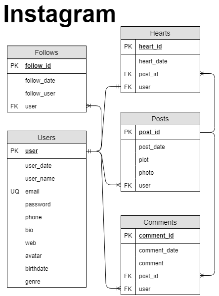

# Lógica de Negocio Instagram

## Modelo Entidad - Relación:

### Entidades:

* Posts
* Users
* Comments
* Hearts
* Follows

### Relaciones:

1. Los **Users** publican **Posts** (*1 - M*).
1. Los **Users** escriben **Comments** (*1 - M*).
1. Los **Posts** tienen **Comments** (*1 -M*).
1. Los **Users** otorgan  **Hearts** (*1 - 1*).
1. Los **Posts** tienen **Hearts** (*1 - M*).
1. Los **Users** tienen  **Follows** (*1 - M*).
1. Los **Users** siguen  **Follows** (*1 - M*).

## Modelo Relacional de la BD

